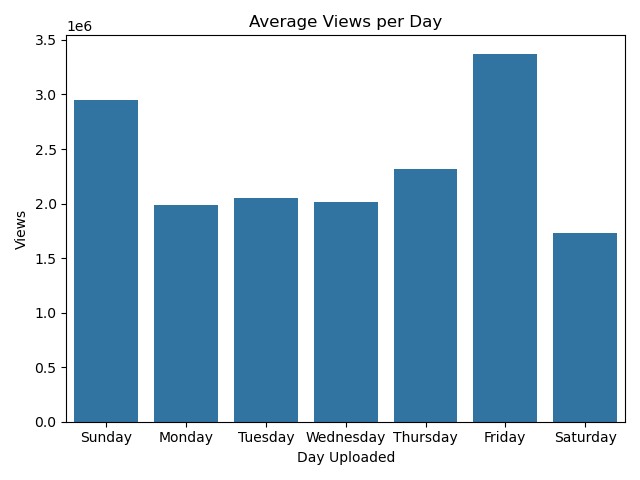
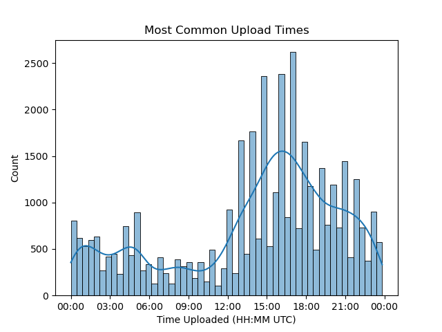
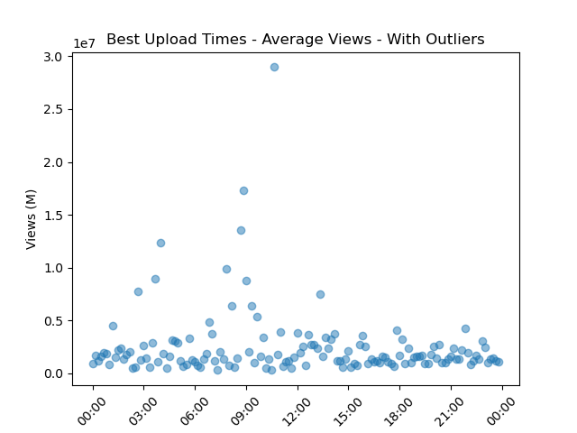
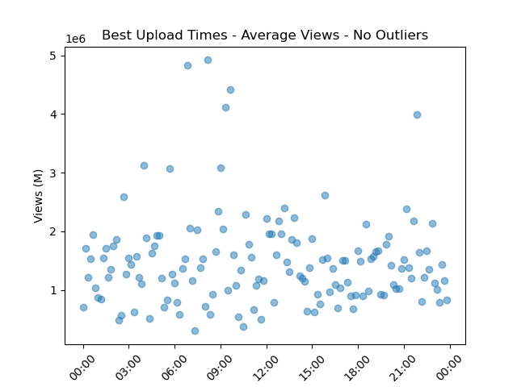
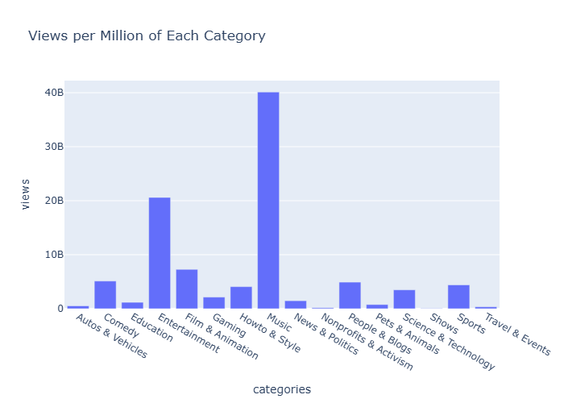

## Trending US YouTube Videos Analysis

# Background

YouTube (the video sharing website) maintains a list of the top-trending videos on its platform. This dataset includes several months of data on up to 200 daily trending YouTube videos from the US, Great Britain, Germany, Canada, France, and other countries. Each region’s data is in a separate file. Data includes the video title, channel title, publish time, tags, views, likes and dislikes, description, and comment count.

The dataset is more fully described on Kaggle, and can be found [here](https://www.kaggle.com/datasets/datasnaek/youtube-new?select=USvideos.csv).

# Goals

- Gain experience using Pandas, Matplotlib and other plotting libraries, and Jupyter Notebooks
- Collaborate with your group on Github
- Create plots and tables that illustrate interesting relationships in your dataset
- Communicate your findings with a presentation

# Findings

We studied the trends for YouTube videos across multiple different metrics:
- By averaging the views on each day of the week, we could see that Sunday and Friday have the most views. This would make sense - the weekends are the days people have the most free time.

- Looking at the most common upload times for YouTube videos, there is a clear rise in uploads between 0700 PST - 1400 PST.

- We also looked at the best time of day to upload a YouTube video. Based on the data, there might be a slightly better time around 0100 PST, but for the most part, the upload time did not affect views.

The most interesting comparison we made was the type of video to how many views there were. As you can see below, the most popular videos are music videos, followed by entertainment, then everything else.

